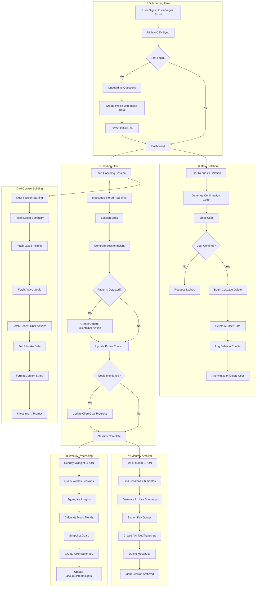

# MyUltra.Coach Database Evolution Plan

## Purpose

This document provides a complete implementation plan for evolving the existing Prisma database schema to support long-term client data management, including summarization layers, smart context windows, archival strategies, and GDPR-compliant data deletion.

---

## Current State Analysis

### Existing Models (11 tables)

| Model | Purpose | Keep/Modify/Deprecate |
|-------|---------|----------------------|
| `User` | Core identity with Skool integration | **MODIFY** - Add client data relations |
| `Profile` | Extended user data, onboarding | **MODIFY** - Enhance with goal/observation relations |
| `Session` | Coaching room sessions | **MODIFY** - Rename clarity, add insight relations |
| `SessionRating` | Post-session feedback | **KEEP** as-is |
| `Message` | In-session chat | **KEEP** - Part of transcript system |
| `Appointment` | Scheduled sessions | **KEEP** as-is |
| `SkoolMonitoringLog` | Skool sync audit | **KEEP** as-is |
| `MembershipStatusHistory` | Status tracking | **KEEP** as-is |
| `AuthCode` | Skool auth codes | **KEEP** as-is |
| `UserSession` | Active sessions | **KEEP** as-is |
| `RateLimit` | Abuse prevention | **KEEP** as-is |

### Schema Reconciliation

The existing `User` model with `skoolVagusEmail` and `vagusSubscriptionStatus` already handles Vagus Skool membership tracking. Rather than creating a separate `vagus_members` table, we'll enhance the existing `User` model and add the new tables as relations.

**Key Insight:** Your current schema uses `User` as the central identity. The proposed `clients` table functionality is partially covered by `Profile`. We'll extend `Profile` rather than create redundancy.

---

## New Models to Add

### 1. SessionInsight (AI-Generated Session Analysis)

```prisma
model SessionInsight {
  id                String   @id @default(cuid())
  sessionId         String   @unique
  userId            String   // Client who had the session
  
  // Structured insights
  summary           String?  @db.Text
  keyTopics         Json?    // String[] of discussed topics
  clientMoodStart   Int?     // AI-assessed mood 1-5
  clientMoodEnd     Int?     // AI-assessed mood 1-5
  breakthroughMoments String[] @default([])
  concernsFlagged   String[] @default([])
  
  // Action items
  clientCommitments String[] @default([])
  suggestedFocusAreas String[] @default([])
  
  // Raw AI output
  rawAnalysis       Json?    // Full LLM response for debugging
  modelVersion      String?  // Which model generated this
  
  // Timestamps
  generatedAt       DateTime @default(now())
  
  // Relations
  session           Session  @relation(fields: [sessionId], references: [id], onDelete: Cascade)
  user              User     @relation(fields: [userId], references: [id], onDelete: Cascade)
  
  @@index([userId])
  @@index([sessionId])
  @@index([generatedAt])
}
```

### 2. ClientObservation (Cross-Session Pattern Detection)

```prisma
model ClientObservation {
  id                String   @id @default(cuid())
  userId            String   // The client being observed
  
  // Observation details
  observationType   String   // 'pattern', 'progress', 'concern', 'milestone', 'breakthrough'
  title             String?
  description       String   @db.Text
  
  // Evidence linking
  relatedSessionIds String[] @default([]) // Session IDs that informed this
  confidenceScore   Float?   @db.DoublePrecision // 0.00 to 1.00
  
  // Human coach verification
  humanVerified     Boolean  @default(false)
  humanVerifiedBy   String?  // Coach user ID who verified
  humanVerifiedAt   DateTime?
  humanNotes        String?  @db.Text
  
  // Lifecycle
  isActive          Boolean  @default(true) // Can be marked outdated
  supersededBy      String?  // ID of newer observation that replaces this
  
  // Timestamps
  createdAt         DateTime @default(now())
  updatedAt         DateTime @updatedAt
  
  // Relations
  user              User     @relation(fields: [userId], references: [id], onDelete: Cascade)
  
  @@index([userId, observationType])
  @@index([userId, isActive])
  @@index([createdAt])
}
```

### 3. ClientGoal (Progress Tracking)

```prisma
model ClientGoal {
  id              String   @id @default(cuid())
  userId          String
  
  // Goal definition
  goalText        String   @db.Text
  category        String?  // 'health', 'wellness', 'energy', 'sleep', 'stress', 'breathing', 'other'
  status          String   @default("active") // 'active', 'achieved', 'paused', 'abandoned'
  
  // Progress tracking
  progressNotes   Json?    // Array of {date, note, progressPct}
  currentProgress Int?     @default(0) // 0-100 percentage
  targetDate      DateTime?
  achievedAt      DateTime?
  
  // Source tracking
  source          String?  // 'onboarding', 'session', 'client_input', 'coach_suggested'
  sourceSessionId String?  // If created from a session
  
  // Timestamps
  createdAt       DateTime @default(now())
  updatedAt       DateTime @updatedAt
  
  // Relations
  user            User     @relation(fields: [userId], references: [id], onDelete: Cascade)
  
  @@index([userId, status])
  @@index([userId, category])
  @@index([createdAt])
}
```

### 4. ClientSummary (Periodic Aggregations)

```prisma
model ClientSummary {
  id                String   @id @default(cuid())
  userId            String
  
  // Period definition
  periodType        String   // 'weekly', 'monthly', 'quarterly'
  periodStart       DateTime
  periodEnd         DateTime
  
  // Aggregated metrics
  sessionCount      Int      @default(0)
  totalDurationMins Int      @default(0)
  averageMoodStart  Float?   @db.DoublePrecision
  averageMoodEnd    Float?   @db.DoublePrecision
  moodTrend         String?  // 'improving', 'stable', 'declining'
  
  // AI-extracted themes
  topTopics         String[] @default([])
  progressHighlights String[] @default([])
  concernsToMonitor String[] @default([])
  
  // Goals snapshot
  goalsProgress     Json?    // Snapshot of goal states at period end
  
  // Session IDs included
  includedSessionIds String[] @default([])
  
  // Generation metadata
  generatedAt       DateTime @default(now())
  modelVersion      String?
  
  // Relations
  user              User     @relation(fields: [userId], references: [id], onDelete: Cascade)
  
  @@unique([userId, periodType, periodStart])
  @@index([userId, periodType])
  @@index([periodEnd])
}
```

### 5. ArchivedTranscript (Long-term Storage)

```prisma
model ArchivedTranscript {
  id              String   @id @default(cuid())
  originalId      String   // Original Message or transcript chunk ID
  sessionId       String
  userId          String
  
  // Archived content
  archiveSummary  String?  @db.Text // AI summary of archived content
  keyQuotes       Json?    // Array of {text, context, timestamp}
  speakerBreakdown Json?   // {client: wordCount, ai: wordCount, coach: wordCount}
  
  // Original metadata
  originalCreatedAt DateTime
  messageCount    Int      @default(0)
  
  // Archive metadata
  archivedAt      DateTime @default(now())
  archiveReason   String?  // 'age', 'storage_optimization', 'user_request'
  
  // Relations
  user            User     @relation(fields: [userId], references: [id], onDelete: Cascade)
  
  @@index([userId])
  @@index([sessionId])
  @@index([archivedAt])
}
```

### 6. DataDeletionRequest (GDPR Compliance)

```prisma
model DataDeletionRequest {
  id              String   @id @default(cuid())
  userId          String
  
  // Request details
  requestType     String   // 'full_deletion', 'partial_deletion', 'data_export'
  requestedScope  Json?    // Specific data categories if partial
  requestReason   String?  @db.Text
  
  // Processing status
  status          String   @default("pending") // 'pending', 'processing', 'completed', 'failed'
  processedAt     DateTime?
  processedBy     String?  // Admin/system that processed
  
  // Audit trail
  deletionLog     Json?    // {table: rowsDeleted} for each table
  errorLog        String?  @db.Text
  
  // Verification
  userConfirmed   Boolean  @default(false)
  confirmationCode String? @unique
  confirmedAt     DateTime?
  
  // Timestamps
  createdAt       DateTime @default(now())
  expiresAt       DateTime // Request expires if not confirmed
  
  // Relations
  user            User     @relation(fields: [userId], references: [id], onDelete: SetNull)
  
  @@index([userId])
  @@index([status])
  @@index([createdAt])
}
```

---

## Modifications to Existing Models

### User Model Additions

```prisma
model User {
  // ... existing fields ...
  
  // NEW: Long-term client data relations
  sessionInsights       SessionInsight[]
  clientObservations    ClientObservation[]
  clientGoals           ClientGoal[]
  clientSummaries       ClientSummary[]
  archivedTranscripts   ArchivedTranscript[]
  dataDeletionRequests  DataDeletionRequest[]
  
  // NEW: Data lifecycle fields
  dataRetentionConsent  Boolean   @default(true)
  lastDataExportAt      DateTime?
  accountDeletionRequestedAt DateTime?
  
  // NEW: Indexes for long-term queries
  @@index([vagusSubscriptionStatus])
  @@index([createdAt])
}
```

### Profile Model Additions

```prisma
model Profile {
  // ... existing fields ...
  
  // NEW: Accumulated context (for AI enhancement)
  accumulatedInsights   String?   @db.Text  // Condensed history for context windows
  lastContextUpdateAt   DateTime?
  contextVersion        Int       @default(0) // Increment on major updates
  
  // NEW: Privacy settings
  allowDataAggregation  Boolean   @default(true)
  allowAnonymizedResearch Boolean @default(false)
}
```

### Session Model Additions

```prisma
model Session {
  // ... existing fields ...
  
  // NEW: Relation to insights
  insight               SessionInsight?
  
  // NEW: Archival status
  isArchived            Boolean   @default(false)
  archivedAt            DateTime?
  
  // NEW: Index for archival queries
  @@index([status, endedAt])
  @@index([isArchived])
}
```

---

## Complete Updated Schema

```prisma
// prisma/schema.prisma

generator client {
  provider = "prisma-client-js"
}

datasource db {
  provider = "postgresql"
  url      = env("DATABASE_URL")
}

// ============================================
// CORE IDENTITY
// ============================================

model User {
  id                    String    @id @default(cuid())
  googleId              String?   @unique
  email                 String    @unique
  displayName           String?
  role                  String    @default("client") // coach, client, admin
  
  // Skool Integration
  skoolUltraEmail       String?
  skoolVagusEmail       String?
  ultraSubscriptionStatus String?
  vagusSubscriptionStatus String?
  lastSkoolSync         DateTime?
  membershipEndDate     DateTime?
  membershipWarningShown Boolean  @default(false)
  
  // Profile Photos
  skoolProfileUrl       String?
  skoolProfilePhotoUrl  String?
  profilePhotoPath      String?
  skoolBio              String?   @db.Text
  skoolJoinedDate       DateTime?
  lastPhotoSync         DateTime?
  
  // Coach-specific
  isAvailable           Boolean   @default(false)
  coachLevel            Int?
  coachName             String?
  
  // Data lifecycle
  dataRetentionConsent  Boolean   @default(true)
  lastDataExportAt      DateTime?
  accountDeletionRequestedAt DateTime?
  
  // Timestamps
  createdAt             DateTime  @default(now())
  updatedAt             DateTime  @updatedAt
  
  // Relations
  profile               Profile?
  appointmentsAsClient  Appointment[] @relation("ClientAppointments")
  appointmentsAsCoach   Appointment[] @relation("CoachAppointments")
  sessions              Session[]
  messages              Message[]
  membershipHistory     MembershipStatusHistory[]
  sessionInsights       SessionInsight[]
  clientObservations    ClientObservation[]
  clientGoals           ClientGoal[]
  clientSummaries       ClientSummary[]
  archivedTranscripts   ArchivedTranscript[]
  dataDeletionRequests  DataDeletionRequest[]
  
  @@index([role])
  @@index([vagusSubscriptionStatus])
  @@index([isAvailable])
  @@index([createdAt])
}

model Profile {
  id                    String    @id @default(cuid())
  userId                String    @unique
  bioJson               Json?
  
  // Client context (AI enhancement)
  clientFacts           String[]  @default([])
  challenges            String[]  @default([])
  preferences           Json?
  lastSummary           String?   @db.Text
  contextNotes          String?   @db.Text
  
  // Accumulated context for smart windows
  accumulatedInsights   String?   @db.Text
  lastContextUpdateAt   DateTime?
  contextVersion        Int       @default(0)
  
  // Onboarding
  onboardingCompleted   Boolean   @default(false)
  onboardingCompletedAt DateTime?
  intakeCoachingGoals   String?   @db.Text
  intakeSymptoms        String?   @db.Text
  intakeInitialMood     Int?
  
  // Privacy settings
  allowDataAggregation  Boolean   @default(true)
  allowAnonymizedResearch Boolean @default(false)
  
  // Timestamps
  createdAt             DateTime  @default(now())
  updatedAt             DateTime  @updatedAt
  
  // Relations
  user                  User      @relation(fields: [userId], references: [id], onDelete: Cascade)
  
  @@index([onboardingCompleted])
}

// ============================================
// SESSIONS & COMMUNICATION
// ============================================

model Session {
  id                String    @id @default(cuid())
  roomId            String
  appointmentId     String
  userId            String
  
  // Session timing
  startedAt         DateTime  @default(now())
  endedAt           DateTime?
  durationMinutes   Int       @default(20)
  
  // Session state
  status            String    @default("active") // active, completed, cancelled
  warningsSent      Int       @default(0)
  
  // Content
  transcript        String?   @db.Text
  aiSummary         String?   @db.Text
  summary           String?   @db.Text
  
  // Archival
  isArchived        Boolean   @default(false)
  archivedAt        DateTime?
  
  // Relations
  user              User        @relation(fields: [userId], references: [id], onDelete: Cascade)
  appointment       Appointment @relation(fields: [appointmentId], references: [id], onDelete: Cascade)
  messages          Message[]
  rating            SessionRating?
  insight           SessionInsight?
  
  @@unique([appointmentId, userId])
  @@index([userId, status])
  @@index([status, endedAt])
  @@index([isArchived])
}

model SessionRating {
  id          String    @id @default(cuid())
  sessionId   String    @unique
  rating      Int       // 1-5
  comment     String?   @db.Text
  tipAmount   Float?
  createdAt   DateTime  @default(now())
  
  session     Session   @relation(fields: [sessionId], references: [id], onDelete: Cascade)
}

model Message {
  id          String    @id @default(cuid())
  sessionId   String
  userId      String
  sender      String    // client, coach, ai
  content     String    @db.Text
  createdAt   DateTime  @default(now())
  
  session     Session   @relation(fields: [sessionId], references: [id], onDelete: Cascade)
  user        User      @relation(fields: [userId], references: [id], onDelete: Cascade)
  
  @@index([sessionId, createdAt])
}

// ============================================
// LONG-TERM CLIENT DATA
// ============================================

model SessionInsight {
  id                  String    @id @default(cuid())
  sessionId           String    @unique
  userId              String
  
  // Structured insights
  summary             String?   @db.Text
  keyTopics           Json?     // String[]
  clientMoodStart     Int?      // 1-5
  clientMoodEnd       Int?      // 1-5
  breakthroughMoments String[]  @default([])
  concernsFlagged     String[]  @default([])
  
  // Action items
  clientCommitments   String[]  @default([])
  suggestedFocusAreas String[]  @default([])
  
  // Raw AI output
  rawAnalysis         Json?
  modelVersion        String?
  
  generatedAt         DateTime  @default(now())
  
  session             Session   @relation(fields: [sessionId], references: [id], onDelete: Cascade)
  user                User      @relation(fields: [userId], references: [id], onDelete: Cascade)
  
  @@index([userId])
  @@index([generatedAt])
}

model ClientObservation {
  id                String    @id @default(cuid())
  userId            String
  
  // Observation details
  observationType   String    // pattern, progress, concern, milestone, breakthrough
  title             String?
  description       String    @db.Text
  
  // Evidence
  relatedSessionIds String[]  @default([])
  confidenceScore   Float?    @db.DoublePrecision
  
  // Human verification
  humanVerified     Boolean   @default(false)
  humanVerifiedBy   String?
  humanVerifiedAt   DateTime?
  humanNotes        String?   @db.Text
  
  // Lifecycle
  isActive          Boolean   @default(true)
  supersededBy      String?
  
  createdAt         DateTime  @default(now())
  updatedAt         DateTime  @updatedAt
  
  user              User      @relation(fields: [userId], references: [id], onDelete: Cascade)
  
  @@index([userId, observationType])
  @@index([userId, isActive])
  @@index([createdAt])
}

model ClientGoal {
  id              String    @id @default(cuid())
  userId          String
  
  // Goal definition
  goalText        String    @db.Text
  category        String?   // health, wellness, energy, sleep, stress, breathing
  status          String    @default("active") // active, achieved, paused, abandoned
  
  // Progress
  progressNotes   Json?     // [{date, note, progressPct}]
  currentProgress Int?      @default(0)
  targetDate      DateTime?
  achievedAt      DateTime?
  
  // Source
  source          String?   // onboarding, session, client_input, coach_suggested
  sourceSessionId String?
  
  createdAt       DateTime  @default(now())
  updatedAt       DateTime  @updatedAt
  
  user            User      @relation(fields: [userId], references: [id], onDelete: Cascade)
  
  @@index([userId, status])
  @@index([userId, category])
}

model ClientSummary {
  id                  String    @id @default(cuid())
  userId              String
  
  // Period
  periodType          String    // weekly, monthly, quarterly
  periodStart         DateTime
  periodEnd           DateTime
  
  // Metrics
  sessionCount        Int       @default(0)
  totalDurationMins   Int       @default(0)
  averageMoodStart    Float?    @db.DoublePrecision
  averageMoodEnd      Float?    @db.DoublePrecision
  moodTrend           String?   // improving, stable, declining
  
  // AI themes
  topTopics           String[]  @default([])
  progressHighlights  String[]  @default([])
  concernsToMonitor   String[]  @default([])
  
  // Goals snapshot
  goalsProgress       Json?
  includedSessionIds  String[]  @default([])
  
  generatedAt         DateTime  @default(now())
  modelVersion        String?
  
  user                User      @relation(fields: [userId], references: [id], onDelete: Cascade)
  
  @@unique([userId, periodType, periodStart])
  @@index([userId, periodType])
  @@index([periodEnd])
}

// ============================================
// ARCHIVAL & DATA LIFECYCLE
// ============================================

model ArchivedTranscript {
  id                String    @id @default(cuid())
  originalId        String
  sessionId         String
  userId            String
  
  // Archived content
  archiveSummary    String?   @db.Text
  keyQuotes         Json?     // [{text, context, timestamp}]
  speakerBreakdown  Json?     // {client: n, ai: n, coach: n}
  
  // Original metadata
  originalCreatedAt DateTime
  messageCount      Int       @default(0)
  
  // Archive metadata
  archivedAt        DateTime  @default(now())
  archiveReason     String?   // age, storage_optimization, user_request
  
  user              User      @relation(fields: [userId], references: [id], onDelete: Cascade)
  
  @@index([userId])
  @@index([sessionId])
  @@index([archivedAt])
}

model DataDeletionRequest {
  id                String    @id @default(cuid())
  userId            String
  
  // Request details
  requestType       String    // full_deletion, partial_deletion, data_export
  requestedScope    Json?
  requestReason     String?   @db.Text
  
  // Status
  status            String    @default("pending") // pending, processing, completed, failed
  processedAt       DateTime?
  processedBy       String?
  
  // Audit
  deletionLog       Json?     // {table: rowsDeleted}
  errorLog          String?   @db.Text
  
  // Verification
  userConfirmed     Boolean   @default(false)
  confirmationCode  String?   @unique
  confirmedAt       DateTime?
  
  createdAt         DateTime  @default(now())
  expiresAt         DateTime
  
  user              User      @relation(fields: [userId], references: [id], onDelete: SetNull)
  
  @@index([userId])
  @@index([status])
  @@index([createdAt])
}

// ============================================
// SCHEDULING
// ============================================

model Appointment {
  id            String    @id @default(cuid())
  scheduledFor  DateTime
  durationMin   Int       @default(30)
  clientId      String
  coachId       String
  roomId        String    @unique
  status        String    @default("scheduled") // scheduled, active, completed, cancelled
  cancelledAt   DateTime?
  cancelledBy   String?
  createdAt     DateTime  @default(now())
  
  client        User      @relation("ClientAppointments", fields: [clientId], references: [id], onDelete: Cascade)
  coach         User      @relation("CoachAppointments", fields: [coachId], references: [id], onDelete: Cascade)
  sessions      Session[]
  
  @@index([status, scheduledFor])
  @@index([clientId, scheduledFor])
  @@index([coachId, status])
}

// ============================================
// SKOOL INTEGRATION & AUTH
// ============================================

model SkoolMonitoringLog {
  id              Int       @id @default(autoincrement())
  community       String    // ultra, vagus
  membersFound    Int
  newMembers      Int
  cancelledMembers Int
  syncDurationMs  Int
  success         Boolean
  errorMessage    String?   @db.Text
  executedAt      DateTime  @default(now())
  
  @@index([community, executedAt])
}

model MembershipStatusHistory {
  id                String    @id @default(cuid())
  userId            String
  community         String    // ultra, vagus
  previousStatus    String?
  newStatus         String
  changeDetectedAt  DateTime  @default(now())
  
  user              User      @relation(fields: [userId], references: [id], onDelete: Cascade)
  
  @@index([userId, community])
}

model AuthCode {
  id                String    @id @default(cuid())
  code              String    @unique
  skoolUserId       String
  skoolUsername     String
  generatedAt       DateTime  @default(now())
  expiresAt         DateTime
  usedAt            DateTime?
  usedIpAddress     String?
  userAgent         String?
  deviceFingerprint String?
  isActive          Boolean   @default(true)
  
  userSessions      UserSession[]
  
  @@index([code])
  @@index([skoolUserId, generatedAt])
}

model UserSession {
  id                String    @id @default(cuid())
  sessionId         String    @unique
  skoolUserId       String
  skoolUsername     String
  authCodeUsed      String
  createdAt         DateTime  @default(now())
  expiresAt         DateTime
  lastActive        DateTime  @default(now())
  ipAddress         String?
  userAgent         String?
  deviceFingerprint String?
  isActive          Boolean   @default(true)
  
  authCode          AuthCode  @relation(fields: [authCodeUsed], references: [code])
  
  @@index([sessionId])
  @@index([skoolUserId])
  @@index([expiresAt])
}

model RateLimit {
  id            String    @id @default(cuid())
  skoolUserId   String
  requestDate   DateTime  @db.Date
  requestCount  Int       @default(1)
  lastRequestAt DateTime  @default(now())
  
  @@unique([skoolUserId, requestDate])
  @@index([skoolUserId, requestDate])
}
```

---

## Migration Strategy

### Phase 1: Add New Tables (Non-Breaking)

```bash
# Create migration for new tables
npx prisma migrate dev --name add_long_term_client_tables
```

**Tables Added:**
- SessionInsight
- ClientObservation
- ClientGoal
- ClientSummary
- ArchivedTranscript
- DataDeletionRequest

### Phase 2: Modify Existing Tables

```bash
# Add new fields to existing models
npx prisma migrate dev --name enhance_existing_models
```

**Changes:**
- User: Add data lifecycle fields and relations
- Profile: Add accumulated insights and privacy settings
- Session: Add archival fields and insight relation

### Phase 3: Add Indexes

```bash
# Performance optimization
npx prisma migrate dev --name add_performance_indexes
```

---

## Data Flow Architecture

### New Session Flow

```
1. Session Created
   └── Session record created with status='active'
   
2. During Session
   └── Messages stored in Message table
   
3. Session Ends
   ├── Session.status = 'completed'
   ├── Session.transcript = compiled messages
   └── AI generates SessionInsight
       ├── summary
       ├── keyTopics
       ├── mood assessments
       ├── commitments extracted
       └── concerns flagged
   
4. Post-Session Processing (async)
   ├── Update ClientObservation if patterns detected
   ├── Update ClientGoal progress if relevant
   └── Update Profile.accumulatedInsights
```

### Weekly Summary Generation

```
CRON: Every Sunday at midnight

1. For each active client:
   ├── Query sessions from past 7 days
   ├── Query session insights
   ├── Query goal progress
   └── Generate ClientSummary
       ├── Aggregate metrics
       ├── AI analysis of themes
       └── Mood trend calculation
       
2. Update Profile.accumulatedInsights
   └── Condense weekly insights into context
```

### Archival Process

```
CRON: Monthly on 1st

1. Find sessions older than 6 months
   └── WHERE endedAt < NOW() - INTERVAL '6 months'
   
2. For each old session:
   ├── Generate archive summary from transcript
   ├── Extract key quotes
   ├── Create ArchivedTranscript record
   ├── Delete Message records (keep transcript in Session)
   └── Set Session.isArchived = true
```

### Data Deletion Flow

```
1. User requests deletion
   ├── Create DataDeletionRequest (status='pending')
   ├── Generate confirmationCode
   └── Send confirmation email
   
2. User confirms deletion
   ├── Update status='processing'
   └── Begin deletion cascade
   
3. Deletion cascade (transaction):
   ├── Delete ArchivedTranscripts
   ├── Delete ClientSummaries
   ├── Delete ClientObservations
   ├── Delete ClientGoals
   ├── Delete SessionInsights
   ├── Delete Messages
   ├── Delete SessionRatings
   ├── Delete Sessions
   ├── Delete Appointments
   ├── Delete Profile
   ├── Delete MembershipStatusHistory
   └── Delete or anonymize User
   
4. Log results
   └── DataDeletionRequest.deletionLog = {table: count}
```

---

## Smart Context Window Builder

### Implementation

```typescript
// services/contextBuilder.ts

interface SessionContext {
  recentInsights: string[];
  activeGoals: string[];
  observations: string[];
  intakeData: {
    goals: string;
    symptoms: string;
    initialMood: number;
  };
}

export async function buildSessionContext(userId: string): Promise<string> {
  // 1. Get most recent summary
  const latestSummary = await prisma.clientSummary.findFirst({
    where: { userId },
    orderBy: { periodEnd: 'desc' },
  });
  
  // 2. Get last 3 session insights
  const recentInsights = await prisma.sessionInsight.findMany({
    where: { userId },
    orderBy: { generatedAt: 'desc' },
    take: 3,
    select: {
      summary: true,
      keyTopics: true,
      clientCommitments: true,
      suggestedFocusAreas: true,
    },
  });
  
  // 3. Get active goals
  const activeGoals = await prisma.clientGoal.findMany({
    where: { userId, status: 'active' },
    select: {
      goalText: true,
      currentProgress: true,
      category: true,
    },
  });
  
  // 4. Get recent observations
  const observations = await prisma.clientObservation.findMany({
    where: { userId, isActive: true },
    orderBy: { createdAt: 'desc' },
    take: 5,
    select: {
      observationType: true,
      description: true,
      humanVerified: true,
    },
  });
  
  // 5. Get intake data
  const profile = await prisma.profile.findUnique({
    where: { userId },
    select: {
      intakeCoachingGoals: true,
      intakeSymptoms: true,
      intakeInitialMood: true,
      clientFacts: true,
      challenges: true,
    },
  });
  
  // 6. Format context for AI
  return formatContextForAI({
    summary: latestSummary,
    insights: recentInsights,
    goals: activeGoals,
    observations,
    intake: profile,
  });
}

function formatContextForAI(data: any): string {
  const sections: string[] = [];
  
  // Client background
  if (data.intake) {
    sections.push(`## Client Background
- Original Goals: ${data.intake.intakeCoachingGoals || 'Not specified'}
- Reported Symptoms: ${data.intake.intakeSymptoms || 'Not specified'}
- Initial Mood: ${data.intake.intakeInitialMood}/5
- Known Facts: ${data.intake.clientFacts?.join(', ') || 'None'}
- Challenges: ${data.intake.challenges?.join(', ') || 'None'}`);
  }
  
  // Recent progress
  if (data.summary) {
    sections.push(`## Recent Progress (${data.summary.periodType})
- Sessions: ${data.summary.sessionCount}
- Mood Trend: ${data.summary.moodTrend || 'Unknown'}
- Key Topics: ${data.summary.topTopics?.join(', ') || 'Various'}
- Concerns: ${data.summary.concernsToMonitor?.join(', ') || 'None flagged'}`);
  }
  
  // Active goals
  if (data.goals?.length > 0) {
    const goalList = data.goals
      .map((g: any) => `- [${g.currentProgress}%] ${g.goalText}`)
      .join('\n');
    sections.push(`## Active Goals\n${goalList}`);
  }
  
  // Recent insights
  if (data.insights?.length > 0) {
    const insightList = data.insights
      .map((i: any) => `- ${i.summary}`)
      .join('\n');
    sections.push(`## Recent Session Themes\n${insightList}`);
  }
  
  // Observations
  if (data.observations?.length > 0) {
    const obsList = data.observations
      .filter((o: any) => o.observationType === 'pattern' || o.observationType === 'concern')
      .map((o: any) => `- [${o.observationType}] ${o.description}`)
      .join('\n');
    if (obsList) {
      sections.push(`## Patterns & Concerns\n${obsList}`);
    }
  }
  
  return sections.join('\n\n');
}
```

---

## GDPR Data Deletion Service

### Implementation

```typescript
// services/dataDeletion.ts

import { prisma } from '@/lib/prisma';
import { randomBytes } from 'crypto';

interface DeletionResult {
  success: boolean;
  deletedCounts: Record<string, number>;
  errors: string[];
}

export async function initiateDataDeletion(
  userId: string,
  requestType: 'full_deletion' | 'partial_deletion' | 'data_export'
): Promise<{ requestId: string; confirmationCode: string }> {
  const confirmationCode = `DEL-${randomBytes(8).toString('hex').toUpperCase()}`;
  const expiresAt = new Date(Date.now() + 7 * 24 * 60 * 60 * 1000); // 7 days
  
  const request = await prisma.dataDeletionRequest.create({
    data: {
      userId,
      requestType,
      confirmationCode,
      expiresAt,
    },
  });
  
  // TODO: Send confirmation email with code
  
  return {
    requestId: request.id,
    confirmationCode,
  };
}

export async function confirmAndExecuteDeletion(
  confirmationCode: string
): Promise<DeletionResult> {
  const request = await prisma.dataDeletionRequest.findUnique({
    where: { confirmationCode },
  });
  
  if (!request) {
    return { success: false, deletedCounts: {}, errors: ['Invalid confirmation code'] };
  }
  
  if (request.expiresAt < new Date()) {
    return { success: false, deletedCounts: {}, errors: ['Request expired'] };
  }
  
  if (request.status !== 'pending') {
    return { success: false, deletedCounts: {}, errors: ['Request already processed'] };
  }
  
  const userId = request.userId;
  const deletedCounts: Record<string, number> = {};
  const errors: string[] = [];
  
  try {
    // Update request status
    await prisma.dataDeletionRequest.update({
      where: { id: request.id },
      data: {
        status: 'processing',
        userConfirmed: true,
        confirmedAt: new Date(),
      },
    });
    
    // Execute deletion in transaction
    await prisma.$transaction(async (tx) => {
      // 1. Delete archived transcripts
      const archived = await tx.archivedTranscript.deleteMany({
        where: { userId },
      });
      deletedCounts.archivedTranscripts = archived.count;
      
      // 2. Delete client summaries
      const summaries = await tx.clientSummary.deleteMany({
        where: { userId },
      });
      deletedCounts.clientSummaries = summaries.count;
      
      // 3. Delete client observations
      const observations = await tx.clientObservation.deleteMany({
        where: { userId },
      });
      deletedCounts.clientObservations = observations.count;
      
      // 4. Delete client goals
      const goals = await tx.clientGoal.deleteMany({
        where: { userId },
      });
      deletedCounts.clientGoals = goals.count;
      
      // 5. Delete session insights
      const insights = await tx.sessionInsight.deleteMany({
        where: { userId },
      });
      deletedCounts.sessionInsights = insights.count;
      
      // 6. Delete messages
      const messages = await tx.message.deleteMany({
        where: { userId },
      });
      deletedCounts.messages = messages.count;
      
      // 7. Delete session ratings (via session cascade)
      // This happens automatically due to onDelete: Cascade
      
      // 8. Delete sessions
      const sessions = await tx.session.deleteMany({
        where: { userId },
      });
      deletedCounts.sessions = sessions.count;
      
      // 9. Delete appointments (as client)
      const appointments = await tx.appointment.deleteMany({
        where: { clientId: userId },
      });
      deletedCounts.appointments = appointments.count;
      
      // 10. Delete membership history
      const history = await tx.membershipStatusHistory.deleteMany({
        where: { userId },
      });
      deletedCounts.membershipHistory = history.count;
      
      // 11. Delete profile
      const profile = await tx.profile.deleteMany({
        where: { userId },
      });
      deletedCounts.profile = profile.count;
      
      // 12. Delete or anonymize user
      if (request.requestType === 'full_deletion') {
        await tx.user.delete({
          where: { id: userId },
        });
        deletedCounts.user = 1;
      } else {
        // Anonymize instead of delete
        await tx.user.update({
          where: { id: userId },
          data: {
            email: `deleted_${userId}@anonymized.local`,
            displayName: 'Deleted User',
            googleId: null,
            skoolVagusEmail: null,
            skoolUltraEmail: null,
            skoolBio: null,
            profilePhotoPath: null,
          },
        });
        deletedCounts.userAnonymized = 1;
      }
    });
    
    // Update request as completed
    await prisma.dataDeletionRequest.update({
      where: { id: request.id },
      data: {
        status: 'completed',
        processedAt: new Date(),
        deletionLog: deletedCounts,
      },
    });
    
    return { success: true, deletedCounts, errors: [] };
    
  } catch (error) {
    const errorMessage = error instanceof Error ? error.message : 'Unknown error';
    errors.push(errorMessage);
    
    await prisma.dataDeletionRequest.update({
      where: { id: request.id },
      data: {
        status: 'failed',
        errorLog: errorMessage,
      },
    });
    
    return { success: false, deletedCounts, errors };
  }
}
```

---

## API Routes to Add

### POST /api/data/deletion/request

```typescript
// apps/api/src/routes/data/deletion.ts

import { Elysia } from 'elysia';
import { initiateDataDeletion, confirmAndExecuteDeletion } from '@/services/dataDeletion';

export const deletionRoutes = new Elysia({ prefix: '/data/deletion' })
  .post('/request', async ({ body, user }) => {
    const { requestType } = body;
    
    const result = await initiateDataDeletion(user.id, requestType);
    
    return {
      success: true,
      message: 'Deletion request created. Check your email for confirmation code.',
      requestId: result.requestId,
    };
  })
  
  .post('/confirm', async ({ body }) => {
    const { confirmationCode } = body;
    
    const result = await confirmAndExecuteDeletion(confirmationCode);
    
    if (!result.success) {
      return { success: false, errors: result.errors };
    }
    
    return {
      success: true,
      message: 'Data deletion completed.',
      deletedCounts: result.deletedCounts,
    };
  });
```

---

## Scheduled Jobs

### Weekly Summary Generation

```typescript
// jobs/generateWeeklySummaries.ts

import { prisma } from '@/lib/prisma';

export async function generateWeeklySummaries() {
  const oneWeekAgo = new Date();
  oneWeekAgo.setDate(oneWeekAgo.getDate() - 7);
  
  // Find clients with sessions in the past week
  const clientsWithSessions = await prisma.session.groupBy({
    by: ['userId'],
    where: {
      status: 'completed',
      endedAt: { gte: oneWeekAgo },
    },
  });
  
  for (const { userId } of clientsWithSessions) {
    await generateClientWeeklySummary(userId, oneWeekAgo, new Date());
  }
}

async function generateClientWeeklySummary(
  userId: string,
  periodStart: Date,
  periodEnd: Date
) {
  // Check if summary already exists
  const existing = await prisma.clientSummary.findUnique({
    where: {
      userId_periodType_periodStart: {
        userId,
        periodType: 'weekly',
        periodStart,
      },
    },
  });
  
  if (existing) return;
  
  // Get sessions and insights
  const sessions = await prisma.session.findMany({
    where: {
      userId,
      status: 'completed',
      endedAt: { gte: periodStart, lte: periodEnd },
    },
    include: { insight: true },
  });
  
  if (sessions.length === 0) return;
  
  // Calculate metrics
  const sessionCount = sessions.length;
  const totalDurationMins = sessions.reduce(
    (sum, s) => sum + (s.durationMinutes || 0),
    0
  );
  
  const insights = sessions
    .map(s => s.insight)
    .filter(Boolean);
  
  const moodStarts = insights
    .map(i => i?.clientMoodStart)
    .filter((m): m is number => m !== null && m !== undefined);
  
  const moodEnds = insights
    .map(i => i?.clientMoodEnd)
    .filter((m): m is number => m !== null && m !== undefined);
  
  const avgMoodStart = moodStarts.length > 0
    ? moodStarts.reduce((a, b) => a + b, 0) / moodStarts.length
    : null;
  
  const avgMoodEnd = moodEnds.length > 0
    ? moodEnds.reduce((a, b) => a + b, 0) / moodEnds.length
    : null;
  
  // Determine mood trend
  let moodTrend: string | null = null;
  if (avgMoodStart !== null && avgMoodEnd !== null) {
    const diff = avgMoodEnd - avgMoodStart;
    moodTrend = diff > 0.5 ? 'improving' : diff < -0.5 ? 'declining' : 'stable';
  }
  
  // Extract topics from insights
  const allTopics = insights
    .flatMap(i => (i?.keyTopics as string[]) || []);
  const topTopics = [...new Set(allTopics)].slice(0, 5);
  
  // Extract concerns
  const allConcerns = insights.flatMap(i => i?.concernsFlagged || []);
  const concernsToMonitor = [...new Set(allConcerns)];
  
  // Get current goals for snapshot
  const goals = await prisma.clientGoal.findMany({
    where: { userId, status: 'active' },
    select: { id: true, goalText: true, currentProgress: true },
  });
  
  // Create summary
  await prisma.clientSummary.create({
    data: {
      userId,
      periodType: 'weekly',
      periodStart,
      periodEnd,
      sessionCount,
      totalDurationMins,
      averageMoodStart: avgMoodStart,
      averageMoodEnd: avgMoodEnd,
      moodTrend,
      topTopics,
      concernsToMonitor,
      goalsProgress: goals,
      includedSessionIds: sessions.map(s => s.id),
    },
  });
}
```

### Monthly Archival Job

```typescript
// jobs/archiveOldTranscripts.ts

import { prisma } from '@/lib/prisma';

export async function archiveOldTranscripts() {
  const sixMonthsAgo = new Date();
  sixMonthsAgo.setMonth(sixMonthsAgo.getMonth() - 6);
  
  // Find sessions eligible for archival
  const sessionsToArchive = await prisma.session.findMany({
    where: {
      status: 'completed',
      isArchived: false,
      endedAt: { lt: sixMonthsAgo },
    },
    include: {
      messages: true,
    },
  });
  
  for (const session of sessionsToArchive) {
    await archiveSession(session);
  }
  
  console.log(`Archived ${sessionsToArchive.length} sessions`);
}

async function archiveSession(session: any) {
  const messages = session.messages;
  
  if (messages.length === 0) {
    // Just mark as archived, nothing to archive
    await prisma.session.update({
      where: { id: session.id },
      data: { isArchived: true, archivedAt: new Date() },
    });
    return;
  }
  
  // Generate summary of messages (use AI in production)
  const archiveSummary = `Session from ${session.startedAt.toISOString()}. ${messages.length} messages exchanged.`;
  
  // Extract key quotes (simplified - use AI in production)
  const keyQuotes = messages
    .filter((m: any) => m.content.length > 50)
    .slice(0, 5)
    .map((m: any) => ({
      text: m.content.substring(0, 200),
      speaker: m.sender,
      timestamp: m.createdAt,
    }));
  
  // Calculate speaker breakdown
  const speakerBreakdown = {
    client: messages.filter((m: any) => m.sender === 'client').length,
    ai: messages.filter((m: any) => m.sender === 'ai').length,
    coach: messages.filter((m: any) => m.sender === 'coach').length,
  };
  
  await prisma.$transaction([
    // Create archive record
    prisma.archivedTranscript.create({
      data: {
        originalId: session.id,
        sessionId: session.id,
        userId: session.userId,
        archiveSummary,
        keyQuotes,
        speakerBreakdown,
        originalCreatedAt: session.startedAt,
        messageCount: messages.length,
        archiveReason: 'age',
      },
    }),
    
    // Delete messages
    prisma.message.deleteMany({
      where: { sessionId: session.id },
    }),
    
    // Mark session as archived
    prisma.session.update({
      where: { id: session.id },
      data: { isArchived: true, archivedAt: new Date() },
    }),
  ]);
}
```

---

## Implementation Checklist

### Phase 1: Schema Updates
- [ ] Create migration for new tables
- [ ] Add new fields to existing models
- [ ] Add performance indexes
- [ ] Run migrations on dev database
- [ ] Test all relations work correctly

### Phase 2: Core Services
- [ ] Implement contextBuilder.ts
- [ ] Implement dataDeletion.ts
- [ ] Add session insight generation after sessions
- [ ] Add goal extraction from onboarding

### Phase 3: Scheduled Jobs
- [ ] Set up cron for weekly summaries
- [ ] Set up cron for monthly archival
- [ ] Set up cron for cleaning expired deletion requests

### Phase 4: API Routes
- [ ] Add data deletion request endpoint
- [ ] Add data deletion confirm endpoint
- [ ] Add data export endpoint
- [ ] Add client context endpoint for AI

### Phase 5: Testing
- [ ] Test full data deletion flow
- [ ] Test archival doesn't break session views
- [ ] Test context builder performance
- [ ] Load test with simulated 3+ month client

---

## Database Relationship Diagram (Mermaid)

```mermaid
erDiagram
    User ||--o| Profile : has
    User ||--o{ Session : participates
    User ||--o{ Message : sends
    User ||--o{ Appointment : "books (client)"
    User ||--o{ Appointment : "hosts (coach)"
    User ||--o{ SessionInsight : generates
    User ||--o{ ClientObservation : about
    User ||--o{ ClientGoal : tracks
    User ||--o{ ClientSummary : summarizes
    User ||--o{ ArchivedTranscript : archives
    User ||--o{ DataDeletionRequest : requests
    User ||--o{ MembershipStatusHistory : logs
    
    Profile {
        string id PK
        string userId FK
        json bioJson
        string[] clientFacts
        string[] challenges
        json preferences
        text accumulatedInsights
        boolean onboardingCompleted
        text intakeCoachingGoals
        text intakeSymptoms
        int intakeInitialMood
    }
    
    Session ||--o| SessionRating : receives
    Session ||--o| SessionInsight : analyzed_by
    Session ||--o{ Message : contains
    Session }o--|| Appointment : belongs_to
    
    Session {
        string id PK
        string roomId
        string appointmentId FK
        string userId FK
        datetime startedAt
        datetime endedAt
        string status
        text transcript
        text aiSummary
        boolean isArchived
    }
    
    SessionInsight {
        string id PK
        string sessionId FK
        string userId FK
        text summary
        json keyTopics
        int clientMoodStart
        int clientMoodEnd
        string[] breakthroughMoments
        string[] concernsFlagged
        string[] clientCommitments
        string[] suggestedFocusAreas
    }
    
    ClientObservation {
        string id PK
        string userId FK
        string observationType
        string title
        text description
        string[] relatedSessionIds
        float confidenceScore
        boolean humanVerified
        boolean isActive
    }
    
    ClientGoal {
        string id PK
        string userId FK
        text goalText
        string category
        string status
        json progressNotes
        int currentProgress
        datetime targetDate
        datetime achievedAt
        string source
    }
    
    ClientSummary {
        string id PK
        string userId FK
        string periodType
        datetime periodStart
        datetime periodEnd
        int sessionCount
        int totalDurationMins
        float averageMoodStart
        float averageMoodEnd
        string moodTrend
        string[] topTopics
        json goalsProgress
    }
    
    ArchivedTranscript {
        string id PK
        string sessionId
        string userId FK
        text archiveSummary
        json keyQuotes
        json speakerBreakdown
        int messageCount
        datetime archivedAt
        string archiveReason
    }
    
    DataDeletionRequest {
        string id PK
        string userId FK
        string requestType
        string status
        json deletionLog
        string confirmationCode UK
        boolean userConfirmed
        datetime expiresAt
    }
    
    Appointment {
        string id PK
        datetime scheduledFor
        int durationMin
        string clientId FK
        string coachId FK
        string roomId UK
        string status
    }
    
    Message {
        string id PK
        string sessionId FK
        string userId FK
        string sender
        text content
        datetime createdAt
    }
    
    SessionRating {
        string id PK
        string sessionId FK
        int rating
        text comment
        float tipAmount
    }
```



---

## Visual Flowchart (Mermaid)



---

*Document prepared for Cursor AI implementation*  
*Schema Version: v2.0 (Long-term Client Data)*  
*Date: December 2025*